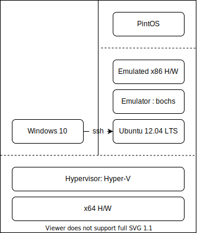

# Index
0. [Installation](./00-installation.md)
1. [Introduction](./01-Introduction.md)
2. [Command Line Parsing](./02-command-line-parsing.md)
3. System Call
4. Hierarchical Process Structure
5. File Descriptor
6. Denying Write to Executable
7. Alarm System Call
8. Priority Scheduling
9. Priority Scheduling and Synchronization
10. Priority Inversion Problem
11. Multi-Level Feedback Queue Scheduler
12. Virtual Memory
13. Memory Mapped File
14. Swapping
15. Stack
16. Buffer Cache
17. Extensible File
18. Subdirectory

# Environments

* OS: Windows 10
* Hypervisor: [Hyper-v Gen 1](https://en.wikipedia.org/wiki/Hyper-V)
  * 주의: Gen 2는 Ubuntu-12.04를 지원하지 않음
* VM: [Ubuntu-12.04 LTS](https://old-releases.ubuntu.com/releases/12.04/ubuntu-12.04-desktop-i386.iso)
* x86 emulator: [bochs-2.6.2](https://en.wikipedia.org/wiki/Bochs)

# Reference
https://oslab.kaist.ac.kr/wp-content/uploads/esos_files/courseware/undergraduate/PINTOS/Pintos_all.pdf
https://web.stanford.edu/class/cs140/projects/pintos/pintos.pdf